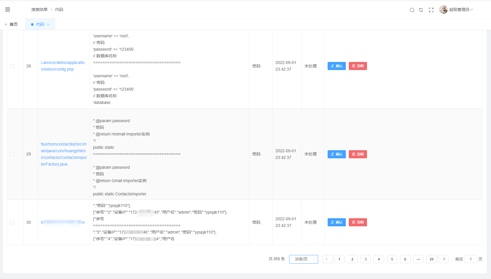

# Gshark_Docker

不知道原项目为啥不搞个docker一键部署，虽然有个docker分支，但是代码却不是最新的，所以自己搞了一个，发现确实有点小麻烦，尽量自动化且简单部署。

# 安装使用

1. docker-compose up -d 

2. 浏览器访问8080端口，会提示初始化数据库，这里输入docker-compose里面的内容：

   主机名：gshark-mysql

   端口：3306

   密码：gshark

   然后使用gshark/gshark默认密码登录系统

3. 启动扫描器（前提是完成第二步初始化数据库，进入到容器里面启动，不然会不能启动，因为会去读数据库）

   ```
   docker exec -d gshark-server sh -c 'nohup ./server scan &> output'
   ```

4. 在页面配置github  token、后缀、修改密码等，愉快玩耍~

   

# 温馨提示

1. 此系统前端现在还有一些BUG！！可能我修（前端不太会），也可能等着官方修了。
2. 本项目会跟着官方master分支**手动**更新。
3. **原项目：https://github.com/madneal/gshark**
